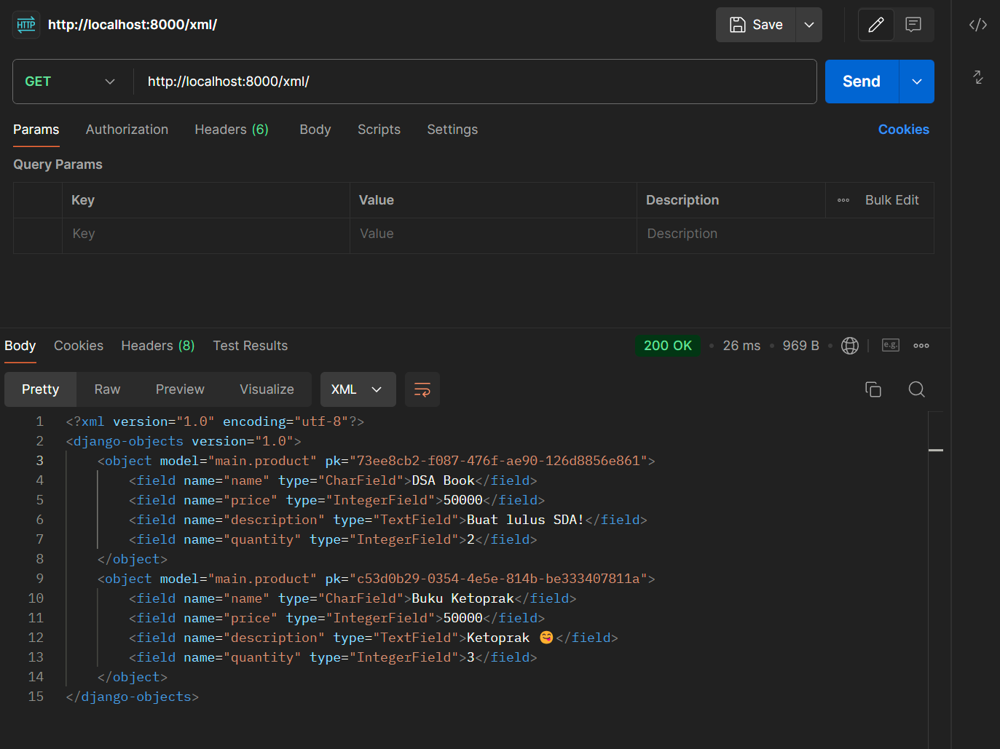

# Bukulapak
Number 1 online bookstore in Pacil!!!

### Deployment
Live web app : [Bukulapak](http://bertrand-gwynfory-bukulapak.pbp.cs.ui.ac.id/)

### Fast Links
- [Tugas 5](#tugas-5)
- [Tugas 4](#tugas-4)
- [Tugas 3](#tugas-3)
- [Tugas 2](#tugas-2)

## Tugas 5

### Jika terdapat beberapa CSS selector untuk suatu elemen HTML, jelaskan urutan prioritas pengambilan CSS selector tersebut!

Terdapat urutan prioritas (specificity) yang akan menentukan CSS selector yang akan digunakan jika terdapat banyak CSS selector yang digunakan pada suatu elemen HTML yang sama. Urutan prioritasnya adalah sebagai berikut:

1. **Inline Styles**: Style yang dimasukkan langsung ke dalam elemen HTML menggunakan atribut `style`.

2. **Id Selector**:  Selector yang menggunakan atribut `id` elemen, ditulis dengan tanda `#`.

3. **Class Selector**: Selector yang menggunakan atribut `class` elemen, ditulis dengan tanda `.`.

4. **Tag Selector**: Selector dengan prioritas terendah, langsung menggunakan tag HTML seperti `body`, `p`, dan `h1`.

5. **Browser Default**: Styles yang diterapkan oleh browser sebagai default.

### Mengapa responsive design menjadi konsep yang penting dalam pengembangan aplikasi web? Berikan contoh aplikasi yang sudah dan belum menerapkan responsive design!

Responsive design adalah konsep penting dalam pengembangan aplikasi web karena memungkinkan tampilan dan fungsi situs web menyesuaikan dengan berbagai ukuran layar dan perangkat yang diggunakan oleh _user_. Responsive design penting untuk memastikan pengalaman `user` yang konsisten dan optimal di berbagai ukuran layar berbeda seperti di desktop, tablet, dan _handphone_.

### Contoh Aplikasi yang Sudah Menerapkan Repsonsive Design:
- **Google**: Fitur untuk _searching_ tetap responsif di berbagai perangkat berbeda.
- **Twitter**: Menyediakan berbagai tampilan dan fungsionalitas yang menyesuaikan dengan perangkat yang digunakan.

### Contoh Aplikasi yang Belum Menerapkan Responsive Design:

- **Pacil Web Service**: Tidak ada support untuk perangkat _mobile_, sehingga tidak bisa melihat informasi proyek-proyek di PWS jika menggunakan perangkat _mobile_.

### Jelaskan perbedaan antara margin, border, dan padding, serta cara untuk mengimplementasikan ketiga hal tersebut!

- **Margin**: Ruang di luar elemen, antara elemen dengan elemen lainnya. Fungsinya untuk mengatur jarak antara suatu elemen dengan elemen lainnya.

- **Border**: Batasan yang mengelilingi elemen. Dapat digunakan untuk mengatur ruang antara margin dan padding, serta membuat sebuah border mengelilingi elemen seperti yang kita ketahui.

- **Padding**: Ruang di dalam elemen, antara konten dalam elemen border elemen tersebut. Padding digunakan untuk memberi jarak antara konten dan ujung elemen.

**Cara Implementasi:**
```CSS
   .container {
      margin: 5px;   /* Memberi jarak 5px antara .container dengan elemen lain*/
      border: 5px solid; /* Membuat border setebal 5px dan juga menambahkan ruang 5px antara margin dan padding*/
      padding: 5px;  /* Memberi jarak 5px antara konten dalam elemen dengan ujung elemen*/
   }
```

### Jelaskan konsep flex box dan grid layout beserta kegunaannya!

Flex box adalah model _layout_ satu dimensi untuk menyusun secara vertikal atau horizontal. Elemen ini akan "_flex_" yaitu akan membesar atau mengecil tergantung aturan yang didefinisikan. Flex box memungkinkan elemen di dalam _container_ untuk diatur secara otomatis tergantung dengan ukuran _viewport_, yang memudahkan kita untuk membuat _layout_ yang fleksibel dan responsif. 

Grid adalah model _layout_ dua dimensi yang memungkinkan kita untuk membuat _design_ yang lebih kompleks dengan baris dan kolom. Grid memungkinkan kita untuk menyusun item secara baris dan kolom. _Grid layout_ bagus dalam membagi halaman menjadi beberapa area utama, seperti header, konten utama, dan footer atau menentukan hubungan dalam hal ukuran, posisi, dan ruang yang diambil antara bagian.

### Langkah Implementasi Checklist

1. **Implementasikan fungsi untuk menghapus dan mengedit product.**

- Pertama, saya menambahkan fungsi baru bernama `edit_book` pada `views.py` yang akan digunakan untuk mengedit buku yang sudah ada sebelumnya.

```python
   def edit_book(request, id):
      # Get book berdasarkan id
      book = Product.objects.get(pk = id)

      # Set book entry sebagai instance dari form
      form = BookForm(request.POST or None, instance=book)

      if form.is_valid() and request.method == "POST":
         # Simpan form dan kembali ke halaman awal
         form.save()
         return HttpResponseRedirect(reverse('main:show_main'))

      context = {'form': form}
      return render(request, "edit_book.html", context)
```

- Selanjutnya, saya juga membuat fungsi baru bernama  `delete_book` pada `views.py` yang akan digunakan untuk menghapus buku yang sudah ada sebelumnya.

```python
   def delete_book(request, id):
      # Get book berdasarkan id
      book = Product.objects.get(pk = id)
      # Hapus book
      book.delete()
      # Kembali ke halaman awal
      return HttpResponseRedirect(reverse('main:show_main'))
   ```

- Langkah terakhir, saya mengimport fungsi `edit_book` dan `delete_book` yang sudah saya buat sebelumnya dan menambahkan path url untuk mengakses fungsi-fungsi yang di-import tersebut pada `urls.py`.

```python
   from django.urls import path
   from main.views import show_main, create_book_entry, show_xml, show_json, show_xml_by_id, show_json_by_id, register, login_user, logout_user, edit_book, delete_book

   app_name = 'main'

   urlpatterns = [
      path('', show_main, name='show_main'),
      path('create-book-entry', create_book_entry, name='create_book_entry'),
      path('xml/', show_xml, name='show_xml'),
      path('json/', show_json, name='show_json'),
      path('xml/<str:id>/', show_xml_by_id, name='show_xml_by_id'),
      path('json/<str:id>/', show_json_by_id, name='show_json_by_id'),
      path('register/', register, name='register'),
      path('login/', login_user, name='login'),
      path('logout/', logout_user, name='logout'),
      path('edit-book/<uuid:id>', edit_book, name='edit_book'),
      path('delete/<uuid:id>', delete_book, name='delete_book'),
   ]
```

2. **Kustomisasi desain pada template HTML menggunakan Tailwind**

- Pertama, saya menambahkan tag `<meta name="viewport">` untuk responsive terhadap perangkat mobile beserta dengan script Tailwind pada file `base.html`.

```HTML
   <meta name="viewport" content="width=device-width, initial-scale=1">
   <script src="https://cdn.tailwindcss.com"></script>
```

- Lalu saya membuat sebuah file css baru bernama `global.css` untuk mengubah beberapa tampilan pada aplikasi saya.

```HTML
   
```

3. **Mengubah README.md.**

- Terakhir, saya mengubah `README.md` yang sebelumnya telah saya buat untuk menambahkan jawaban dari pertanyaan-pertanyaan yang diberikan pada Tugas 5.

## Tugas 4

### Apa perbedaan antara `HttpResponseRedirect()` dan `redirect()`

`HttpResponseRedirect()` dan `redirect()` sebenarnya mempunyai return value yang sama yaitu keduanya akan mengembalikan sebuah `HttpResponseRedirect` yang mengarahkan user ke URL yang ditentukan. Perbedaannya berada pada parameter yang diperbolehkan, `HttpResponseRedirect()` hanya menerima sebuah URL sebagai parameter dalam methodnya, sedangkan `redirect()` memperbolehkan URL, objek model, atau view sebagai parameter dalam method. Oleh karena itu, `redirect()` bisa dibilang lebih fleksibel daripada HttpResponseRedirect().

### Cara kerja penghubungan model Product dengan `User`!

`User` adalah model bawaan dari Django yang memiliki field bawaan username, password, email, first_name, dan last_name.  Model `User` digunakan oleh sistem _authentication_ dan _authorization_ Django untuk mengelola login, logout, dan izin pengguna. Untuk menghubungkan model `Product` dengan `User`, kita bisa menggunakan `ForeignKey` yang akan mendefinisikan _many-to-one relationship_. Dalam model `Product` yang sudah dibuat, `ForeignKey` digunakan untuk menghubungkan setiap `Product` dengan satu `User`. Setiap `Product` akan terkait dengan satu `User`, tetapi satu `User` bisa memiliki banyak `Product`. 

```python
   from django.db import models
   from django.contrib.auth.models import User
   import uuid

   class Product(models.Model):
      user = models.ForeignKey(User, on_delete=models.CASCADE)
      id = models.UUIDField(primary_key=True, editable=False, default=uuid.uuid4)
      name = models.CharField(max_length=255)
      price = models.IntegerField()
      description = models.TextField()
      quantity = models.IntegerField()
```

### Apa perbedaan antara _authentication_ dan _authorization_, apakah yang dilakukan saat pengguna login? Jelaskan bagaimana Django mengimplementasikan kedua konsep tersebut.

_Authentication_ adalah proses verifikasi identitas user. Saat pengguna login, mereka memasukkan kredensial seperti username dan password yang kemudian diverifikasi oleh sistem untuk memastikan bahwa mereka adalah pengguna yang valid. Tujuan utama dari _authentication_ adalah untuk memastikan bahwa pengguna yang mencoba mengakses sistem adalah benar-benar orang yang mereka nyatakan.

_Authorization_ adalah proses menentukan hak akses pengguna setelah mereka berhasil _authenticated_. Setelah pengguna login dan identitas pengguna diverifikasi, _authorization_ menentukan apa yang dapat dilakukan atau diakses oleh pengguna tersebut dalam sistem. Seorang pengguna dengan _role_ _admin_ mungkin memiliki akses penuh ke semua sistem, sementara pengguna dengan _role_ _user_ biasa hanya memiliki akses terbatas.

Untuk _authentication_, Django menyediakan model `User` yang menyimpan informasi pengguna, serta _form_ dan _view_ bawaan seperti `UserCreationForm` dan `AuthenticationForm` yang merupakan bagian dari _module_ `django.contrib.auth`  untuk menangani registrasi dan login pengguna. Saat pengguna login, Django menggunakan _middleware_ untuk menghubungkan pengguna yang terautentikasi dengan setiap _request_. Proses ini memastikan bahwa hanya pengguna yang valid yang dapat mengakses sistem.

Untuk authorization, Django menggunakan sistem authorization bawaaan django yang merupakan bagian dari _module_ `django.contrib.auth`. Sistem ini memungkinkan _developer_ memberikan hak akses tertentu kepada pengguna menggunakan _decorators_ seperti `@permission_required`, `@login_required` atau sebuah _method_ seperti `user.has_perm()`. Setelah pengguna berhasil diautentikasi, Django menentukan hak akses berdasarkan _permission_ yang telah ditetapkan.

### Bagaimana Django mengingat pengguna yang telah login? Jelaskan kegunaan lain dari cookies dan apakah semua cookies aman digunakan?

Django menggunakan _sessions_ dan _cookies_ untuk mengingat pengguna yang telah login. Saat pengguna login, Django membuat _session_ baru dan menyimpan ID _session_ di _cookie_ browser pengguna. Ketika pengguna membuat _request_ baru, _cookie_ ini dikirim ke server yang memungkinkan Django untuk mengidentifikasi pengguna yang sedang login.

**Kegunaan Lain Cookies**:
- _Cookies_ dapat digunakan untuk menyimpan preferensi dari pengguna .
- Melacak data sementara yang berguna tanpa mengharuskan pengguna untuk login.
- `csrf_token` disimpan dalam _cookie_, yang membantu verifikasi _form_ mana yang berasal dari pengguna asli.

Tidak semua _cookie_ dapat dikatakan aman. _Cookies_ yang tidak dikirim melalui saluran yang aman seperti tanpa menggunakan HTTPS dapat dicuri oleh penyerang yang memungkinkan _session hijacking_ dimana penyerang menyamar sebagai pengguna dengan menggunakan _session_ ID pengguna tersebut. _Cookies_ yang tidak dilindungi bisa rentan terharap _Cross-Site Scripting (XSS)_ dimana _script_ jahat dapat mengakses _cookie_ dan masuk ke sistem.

### Langkah Implementasi Checklist

1. **Mengimplementasikan fungsi registrasi, login, dan logout.**

- Pertama saya mengimport `UserCreationForm` dan `messages` pada bagian paling atas `views.py` dan menambahkan fungsi baru bernama `register`.

```python
   from django.contrib.auth.forms import UserCreationForm
   from django.contrib import messages

   def register(request):
      form = UserCreationForm()

      if request.method == "POST":
         form = UserCreationForm(request.POST)
         if form.is_valid():
               form.save()
               messages.success(request, 'Your account has been successfully created!')
               return redirect('main:login')
      context = {'form':form}
      return render(request, 'register.html', context)
```

- Kemudian saya membuat file HTML baru bernama `register.html` pada direktori `main/templates` dengan isi sebagai berikut:

```HTML
   

   
   <title>Register</title>
   

   

   <div class="register">
   <h1 class="form-title">Register Form</h1>

   <form method="POST">
      
      <table>
         {{ form.as_table }}
         <tr>
         <td></td>
         <td><input class="btn" type="submit" name="submit" value="Daftar" /></td>
         </tr>
      </table>
   </form>

   
   <ul>
      
      <li>{{ message }}</li>
      
   </ul>
   
   </div>

   
```

- Selanjutnya saya mengimport `authenticate`, `login`, dan `AuthenticationForm` pada bagian paling atas `views.py` dan menambahkan fungsi baru bernama `login_user`.

```python
   from django.contrib.auth.forms import UserCreationForm, AuthenticationForm
   from django.contrib.auth import authenticate, login

   def login_user(request):
      if request.method == 'POST':
         form = AuthenticationForm(data=request.POST)

         if form.is_valid():
               user = form.get_user()
               login(request, user)
               response = HttpResponseRedirect(reverse("main:show_main"))
               response.set_cookie('last_login', str(datetime.datetime.now()))
               return response

      else:
         form = AuthenticationForm(request)
      context = {'form': form}
      return render(request, 'login.html', context)
```

- Sama seperti untuk `register`, saya juga membuat file HTML baru bernama `login.html` pada direktori `main/templates` dengan isi sebagai berikut:

```HTML
   

   
   <title>Login</title>
   

   
   <div class="login">
   <h1 class="form-title">Login to Bukulapak</h1>

   <form method="POST" action="" class="login-form">
      
      <table class="form-table">
         {{ form.as_table }}
         <tr>
         <td></td>
         <td class="login-btn"><input class="btn login_btn" type="submit" value="Login" /></td>
         </tr>
      </table>
   </form>

   
   <ul>
      
      <li>{{ message }}</li>
      
   </ul>
    
   <div class="register-section">
      Don't have an account yet? <a href="" class="register-btn">Register Now</a>
   </div>
   </div>

   
```

- Untuk fungsi `logout`, sama seperti sebelumnya saya menambahkan import baru bernama `logout` pada bagian atas `views.py` dan menambahkan fungsi baru bernama `logout_user`.

```python
   def logout_user(request):
      logout(request)
      response = HttpResponseRedirect(reverse('main:login'))
      response.delete_cookie('last_login')
      return response
```

- Setelah saya membuat fungsi `logout_user`, saya menambahkan button untuk logout ke `main.html` sebagai berikut:

```HTML
   <a href="">
      <button>Logout</button>
   </a>
```

- Langkah terakhir, saya mengimport fungsi `register`, `login_user`, dan `logout_user` yang sudah saya buat sebelumnya menambahkan path url untuk mengakses fungsi-fungsi yang di-import tersebut pada `urls.py`.

```python
   from django.urls import path
   from main.views import show_main, create_book_entry, show_xml, show_json, show_xml_by_id, show_json_by_id, register, login_user, logout_user

   app_name = 'main'

   urlpatterns = [
      path('', show_main, name='show_main'),
      path('create-book-entry', create_book_entry, name='create_book_entry'),
      path('xml/', show_xml, name='show_xml'),
      path('json/', show_json, name='show_json'),
      path('xml/<str:id>/', show_xml_by_id, name='show_xml_by_id'),
      path('json/<str:id>/', show_json_by_id, name='show_json_by_id'),
      path('register/', register, name='register'),
      path('login/', login_user, name='login'),
      path('logout/', logout_user, name='logout'),
   ]
```

2. **Membuat dua akun pengguna dengan masing-masing tiga dummy data menggunakan model yang telah dibuat pada aplikasi sebelumnya untuk setiap akun di lokal.**

- Saya membuat dua akun bernama cbkadal dan Bertrand pada lokal yang masing-masing berisi tiga dummy data menggunakan model yang telah dibuat sebelumnya (Purcell Kalkulus dan Rosen Matdis saya tetapkan sebagai produk default).

**Akun cbkadal:**


**Akun Bertrand:**


3. **Menghubungkan model `Product` dengan `User`.**

   Untuk menghubungkan model `Product` dengan `User`, saya menggunakan `ForeignKey` yang mendefinisikan _many-to-one relationship_. Saya menggunakan `ForeignKey` untuk menghubungkan setiap `Product` dengan satu `User` yang dimana `Product` akan terkait dengan satu `User`, tetapi satu `User` bisa memiliki banyak `Product`.

```python
   from django.db import models
   from django.contrib.auth.models import User
   import uuid

   class Product(models.Model):
      user = models.ForeignKey(User, on_delete=models.CASCADE)
      id = models.UUIDField(primary_key=True, editable=False, default=uuid.uuid4)
      name = models.CharField(max_length=255)
      price = models.IntegerField()
      description = models.TextField()
      quantity = models.IntegerField()
```

4. **Menampilkan detail informasi pengguna yang sedang logged in seperti username dan menerapkan cookies seperti last login pada halaman utama aplikasi.**

- Saya menampilkan informasi pengguna yang sedang login pada halaman utama dengan menambahkan `request.user.username` pada `context` di fungsi `show_main()` pada `views.py`.

- Kemudian saya melakukan hal yang sama untuk menerapkan _cookies_ seperti last login pada halaman utama aplikasi, yaitu dengan menambahkan `'last_login': request.COOKIES['last_login']` pada `context` di `show_main()` yang akan menambahkan informasi _cookie_ _last_login_ pada response yang akan ditampilkan di halaman utama aplikasi.

```python
   context = { 
        'nama_user': request.user.username,
        'nama_aplikasi' : 'Bukulapak',
        'person' : 'Bertrand Gwynfory Iskandar',
        'npm' : '2306152121',
        'class' : 'PBP C',
        'books' : all_books,
        'last_login': request.COOKIES['last_login'],
    }
```

5. **Mengubah README.md.**

- Terakhir, saya mengubah `README.md` yang sebelumnya telah saya buat untuk menambahkan jawaban dari pertanyaan-pertanyaan yang diberikan pada Tugas 4.


## Tugas 3

### Jelaskan mengapa kita memerlukan _data delivery_ dalam pengimplementasian sebuah platform?

_Data delivery_ penting dalam pengimplementasian sebuah platform karena sebagian besar aplikasi modern mengandalkan pertukaran data antara berbagai komponen dalam platform. _Data delivery_ memastikan bahwa data dapat dipertukar dengan aman, cepat, dan akurat antara client dan server. Tanpa data delivery, aplikasi tidak dapat berfungsi secara optimal karena data yang diperlukan tidak dapat diakses atau disampaikan dengan tepat waktu.

### Mana yang lebih baik antara XML dan JSON? Mengapa JSON lebih populer dibandingkan XML?

Menurut saya sendiri, JSON lebih baik dibandingkan XML. JSON juga lebih populer dan lebih sering digunakan dibandingkan XML karena berbagai alasan berikut:

- **Lebih Ringkas:** 
  JSON menggunakan struktur yang lebih sederhana dibandingkan XML, karena JSON tidak menggunakan tag pembuka dan penutup yang panjang seperti XML. Ini membuat JSON lebih efisien dalam hal ukuran data dan kecepatan parsing, yang sangat berguna untuk aplikasi dengan kebutuhan real-time.

- **Lebih mudah dibaca oleh manusia dan diproses mesin:** 
  JSON lebih mudah dipahami oleh _developer_ dan lebih cepat diproses oleh mesin, karena memiliki struktur yang lebih sederhana dibandingkan XML.

- **Integrasi langsung dalam JavaScript:** 
  JSON secara alami terintegrasi dengan JavaScript karena formatnya berasal langsung dari struktur objek JavaScript, sehingga sangat mudah diimplementasikan dalam aplikasi web yang menggunakan JavaScript di sisi client.

### Jelaskan fungsi dari method `is_valid()` pada form Django dan mengapa kita membutuhkan method tersebut?

Method `is_valid()` pada form Django digunakan untuk memeriksa apakah data yang dikirim melalui form memenuhi aturan validasi yang telah ditentukan pada form. Jika data yang diisi dalam form valid, method ini akan mengembalikan nilai `True` dan menyimpan data yang sudah divalidasi di atribut `cleaned_data` dari form. Jika data tidak valid, method ini akan mengembalikan nilai `False` dan mengeluarkan error yang bisa diakses melalui atribut `form.errors`.

Tanpa method `is_valid()`, data yang tidak benar atau tidak sesuai aturan validasi yang ditentukan bisa masuk ke sistem yang dapat menyebabkan error dan mengancam keamanan aplikasi.

### Mengapa kita membutuhkan `csrf_token` saat membuat form di Django? Apa yang dapat terjadi jika kita tidak menambahkan `csrf_token` pada form Django? Bagaimana hal tersebut dapat dimanfaatkan oleh penyerang?

`csrf_token` adalah token keamanan yang disisipkan oleh Django pada setiap form yang mengirimkan data melalui metode POST. Ketika user menjelajahi _website_, Django menghasilkan `csrf_token` unik untuk setiap sesi. Token ini termasuk dalam form yang dikirim oleh user dan diperiksa oleh server untuk memverifikasi bahwa permintaan tersebut berasal dari user yang terautentikasi dan bukan dari sumber jahat.

Django secara default memeriksa keberadaan `csrf_token` pada setiap permintaan POST. Jika token ini tidak ada atau tidak valid, server akan mengembalikan error 403 (Forbidden), yang berarti permintaan tersebut ditolak.

Jika `csrf_token` tidak digunakan, penyerang dapat membuat halaman palsu yang berisi form tersembunyi atau script yang mengirimkan permintaan POST ke server atas nama pengguna yang sedang login.

### Langkah Implementasi Checklist

1. **Membuat input `form` untuk menambahkan objek model pada app sebelumnya.**
   - Saya pertama membuat sebuah class BookForm di file forms.py yang merupakan subclass dari ModelForm di Django. Class ini digunakan untuk menghasilkan form berdasarkan model Product.

   ```python
      from django.forms import ModelForm
      from main.models import Product

      class BookForm(ModelForm):
         class Meta:
            model = Product
            fields = ["name", "price", "description", "quantity"]
   ```
   
   - Kemudian, saya membuat sebuah fungsi `create_book_entry` dalam file `views.py` untuk menangani pembuatan form baru. Fungsi ini menerima request dari pengguna dan membuat instance dari `BookForm`, dengan data POST jika ada.

   ```python
      def create_book_entry(request):
         form = BookForm(request.POST or None)

         if form.is_valid() and request.method == "POST":
            form.save()
            return redirect('main:show_main')

         context = {'form': form}
         return render(request, "create_book_entry.html", context)
   ```

   - Selanjutnya, saya membuat template HTML bernama `create_book_entry.html` untuk menampilkan form.

   ```HTML
       
      
      <div class="form-container">
         <h1 class="form-title">Add New Book</h1>

         <form method="POST">
               
               <table>
                  {{ form.as_table }}
                  <tr>
                     <td></td>
                     <td class="button-container-form">
                           <input type="submit" value="Add Book" class="add-button" />
                     </td>
                  </tr>
               </table>
         </form>
      </div>

      
   ```

   - Terakhir, saya menambahkan path URL di file `urls.py` untuk mengakses fungsi form.

   ```python
      from django.urls import path
      from main.views import show_main, create_book_entry

      app_name = 'main'

      urlpatterns = [
         path('', show_main, name='show_main'),
         path('create-book-entry', create_book_entry, name='create_book_entry'),
      ]
   ```

2. **Menambahkan 4 fungsi views baru untuk melihat objek yang sudah ditambahkan dalam format XML, JSON, XML by ID, dan JSON by ID.**

   - Memambahkan fungsi view untuk XML pada `views.py`.

   ```python
      def show_xml(request):
         data = Product.objects.all()
         return HttpResponse(serializers.serialize("xml", data), content_type="application/xml")
   ```

   - Memambahkan fungsi view untuk JSON pada `views.py`.

   ```python
      def show_json(request):
         data = Product.objects.all()
         return HttpResponse(serializers.serialize("json", data), content_type="application/json")
   ```

   - Memambahkan fungsi view untuk XML by ID pada `views.py`.

   ```python
      def show_xml_by_id(request, id):
         data = Product.objects.filter(pk=id)
         return HttpResponse(serializers.serialize("xml", data), content_type="application/xml")
   ```

   - Menambahkan fungsi view untuk JSON by ID pada `views.py`.

   ```python
      def show_json_by_id(request, id):
         data = Product.objects.filter(pk=id)
         return HttpResponse(serializers.serialize("json", data), content_type="application/json")
   ```

   - Terakhir, saya menambahkan path url di `urls.py` untuk mengakses 4 fungsi tersebut. 

   ```python
      from django.urls import path
      from main.views import show_main, create_book_entry, show_xml, show_json, show_xml_by_id, show_json_by_id

      app_name = 'main'

      urlpatterns = [
         path('', show_main, name='show_main'),
         path('create-book-entry', create_book_entry, name='create_book_entry'),
         path('xml/', show_xml, name='show_xml'),
         path('json/', show_json, name='show_json'),
         path('xml/<str:id>/', show_xml_by_id, name='show_xml_by_id'),
         path('json/<str:id>/', show_json_by_id, name='show_json_by_id'),
      ]
   ```
3. **Mengubah README.md.**

   - Terakhir, saya mengubah `README.md` yang sebelumnya telah saya buat untuk menambahkan jawaban dari pertanyaan-pertanyaan yang diberikan pada Tugas 3.

### Screenshot Hasil Akses Keempat URL Pada Postman
**XML**


**XML BY ID**


**JSON**


**JSON BY ID**


## Tugas 2

### Langkah Implementasi Checklist

1. **Membuat Direktori Proyek.**
   - Saya mulai dengan membuat sebuah direktori untuk proyek saya dengan perintah `mkdir bukulapak` di terminal. Saya membuat virtual environment di dalam direktori proyek dengan perintah `python -m venv env`. Setelah itu, saya mengaktifkan virtual environment dengan perintah source env/bin/activate di terminal. Dengan ini, saya dapat menginstall paket Python dalam lingkungan terisolasi tanpa mempengaruhi sistem Python global.

2. **Mempersiapkan _Dependencies_.**
   - Saya membuat file bernama requirements.txt yang di dalamnya berisi semua _dependencies_ yang diperlukan. Setelah menyimpan file requirements.txt, saya menginstal semua _dependencies_ yang terdaftar di dalamnya dengan perintah `pip install -r requirements.txt`. Ini akan menginstal semua _dependencies_ yang diperlukan ke dalam virtual environment yang aktif.

3. **Membuat Proyek Django Baru.** 
   - Saya kemudian membuat proyek Django baru dengan menjalankan perintah `django-admin startproject bukulapak`. di direktori proyek. Perintah ini akan menginisialisasi proyek Django baru dengan nama bukulapak di direktori saat ini dan membuat struktur direktori dasar untuk proyek Django.

4. **Membuat Aplikasi Dengan Nama `main`.**
   - Setelah proyek Django berhasil dibuat, saya menambahkan aplikasi baru dengan nama `main` di dalam proyek tersebut dengan menjalankan perintah `python manage.py startapp main`. Aplikasi ini akan berisi fitur spesifik yang akan dikembangkan lebih lanjut.

5. **Melakukan Routing Pada Proyek Agar Dapat Menjalankan Aplikasi `main`.**
   - Untuk memastikan aplikasi `main` dapat diakses, saya melakukan routing di berkas `urls.py` yang ada di direktori proyek `bukulapak/urls.py`. Saya menambahkan rute yang mengarahkan permintaan ke aplikasi "main" dengan menambahkan baris kode berikut:
   
   
   ```python
    from django.contrib import admin
    from django.urls import path
    from django.urls import path, include

    urlpatterns = [
        path('admin/', admin.site.urls),
        path('', include('main.urls')),
    ]
    ```

6. **Membuat Model Pada Aplikasi `main` Dengan Nama `Product`.**
   - Kemudian saya membuat model `Product` di `models.py` yang memiliki atribut `name`, `price`, `description`, dan `quantity`.


   ```python
    from django.db import models

    class Product(models.Model):
        name = models.CharField(max_length=255)
        price = models.IntegerField()
        description = models.TextField()
        quantity = models.IntegerField()

        @property
        def is_product_available(self):
            return self.quantity > 0
   ```

7. **Membuat Sebuah Fungsi Pada `views.py` Untuk Dikembalikan ke Dalam Sebuah Template HTML Yang Menampilkan Nama Aplikasi Serta Nama dan Kelas Saya.**
   - Saya membuat template main.html di dalam direktori `templates` aplikasi `main` untuk menampilkan data dari model Product berserta nama dan kelas saya. Kemudian saya menambahkan fungsi show_main di berkas main/views.py untuk merender template HTML yang sudah saya buat. Template menampilkan informasi seperti nama aplikasi, data produk, dan nama beserta dengan kelas saya.


   ```python
    from django.shortcuts import render

    def show_main(request):
        context = {
            'name' : 'Buku 1',
            'price': '50.000',
            'description': 'A very interesting read!',
            'quantity': '2',
            'nama_aplikasi' : 'Bukulapak',
            'person' : 'Bertrand Gwynfory Iskandar',
            'npm' : '2306152121',
            'class' : 'PBP C',
        }

        return render(request, "main.html", context)
   ```

8. **Membuat Sebuah Routing Pada `urls.py` Aplikasi `main` Untuk Memetakan Fungsi Yang Telah Dibuat Pada `views.py`.**
   - Di dalam berkas `urls.py` pada aplikasi `main`, saya menambahkan rute untuk memetakan URL ke fungsi yang telah saya buat di `views.py` dengan kode dibawah:


   ```python
    from django.urls import path
    from main.views import show_main

    app_name = 'main'

    urlpatterns = [
        path('', show_main, name='show_main'),
    ]
   ```

9. **Melakukan Deployment ke PWS.**
   - Setelah semuanya selesai, saya melakukan deployment aplikasi saya ke Pacil Web Service atau PWS sehingga nantinya dapat diakses melalui Internet.

10. **Membuat README.md.**
    - Terakhir, saya membuat sebuah file `README.md` yang berisi tautan menuju aplikasi PWS yang sudah di-_deploy_, serta jawaban dari pertanyaan-pertanyaan yang diberikan.

### Bagan Berisi Request Client ke Web Aplikasi Berbasis Django Beserta Responnya


Alur permintaan di aplikasi Django dimulai ketika `Client` mengirimkan request ke server Django. Pertama-tama, urls.py menentukan fungsi mana di views.py yang harus menangani request tersebut. Setelah permintaan diarahkan ke fungsi yang tepat di views.py, fungsi ini akan memproses data dan, jika diperlukan, bekerja dengan models.py untuk `read` atau `write` data di database. Setelah pemrosesan selesai, views.py akan menggunakan template HTML yang ada di folder templates untuk merender tampilan akhir. Hasil dari render ini kemudian dikirim kembali ke `Client` sebagai respons HTTP dari server Django.

### Fungsi Git Dalam Pengembangan Perangkat Lunak

Git adalah _version control system_ yang sangat penting dalam pengembangan perangkat lunak. Dengan menggunakan git, _developer_ dapat melacak perubahan yang terjadi pada proyek, berkolaborasi dengan _developer_ lain, dan mengelola proyek secara efisien melalui berbagai fitur yang ditawarkan. Beberapa fitur git adalah sebagai berikut:

- **Version Control:** 
  Git mencatat setiap perubahan pada kode, memungkinkan _developer_ untuk mengakses versi sebelumnya kapan saja, yang sangat membantu dalam mengatur perubahan.

- **Kolaborasi:** 
  Dengan fitur _branching_, beberapa _developer_ dapat bekerja pada proyek yang sama tanpa mengganggu satu sama lain, dan kemudian   menggabungkan hasilnya melalui proses merging.

- **Distribusi:** 
  _Developer_ dapat bekerja secara lokal tanpa koneksi internet dan melakukan sinkronisasi dengan repositori pusat saat sudah tersedia akses, menjadikan Git alat yang fleksibel dalam berbagai situasi.

### Kenapa Django Dijadikan Permulaan Pengembangan Perangkat Lunak?

Django dijadikan permulaan perangkat lunak karena bisa dibilang lebih _beginner-friendly_. Django mengikuti konsep MVT (Model-View_Template) yang memisahkan data, tampilan, _templating_, dan _routing_ aplikasi, sehingga membantu pemula memahami struktur aplikasi web dengan lebih mudah. Django menangani banyak kerepotan dalam pengembangan web, sehingga pemula dapat fokus pada pembuatan aplikasi tanpa perlu menciptakan ulang hal-hal yang sudah ada. Selain hal ini,Django juga memiliki ekosistem yang lengkap dan komunitas besar yang mendukung pemula dalam mempelajari Django. 

### Mengapa model pada Django disebut sebagai _Object-Relational Mapping_ (ORM)?

Model pada Django disebut sebagai _Object-Relational Mapping_ (ORM) karena memungkinkan _developer_ untuk berinteraksi dengan database relasional menggunakan objek Python. Dengan menggunakan model Django, _developer_ dapat mengatur database melalui objek Python, tanpa harus menulis _query_ SQL secara langsung. ORM memetakan tabel-tabel di database ke dalam objek Python, sehingga pengelolaan data menjadi lebih mudah dan efisien.